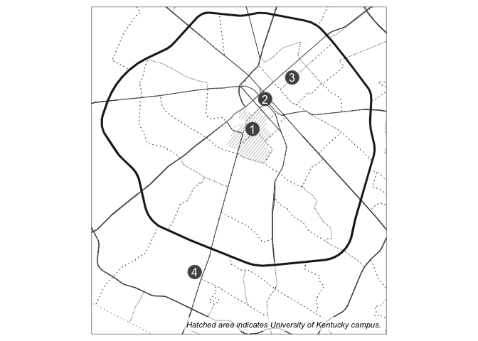
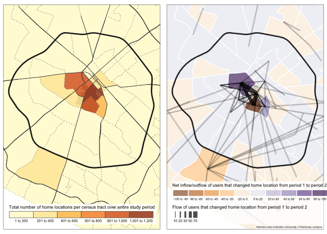
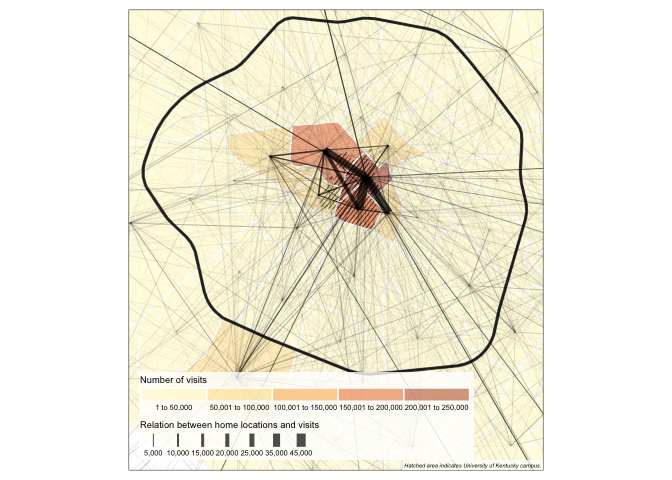
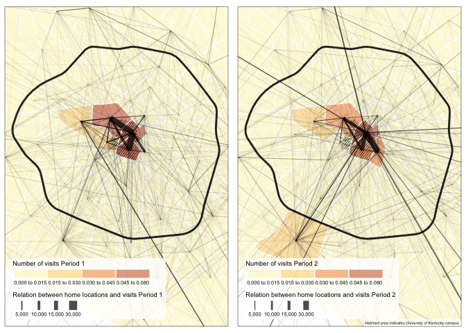
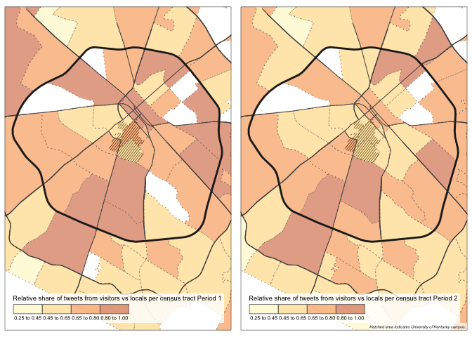
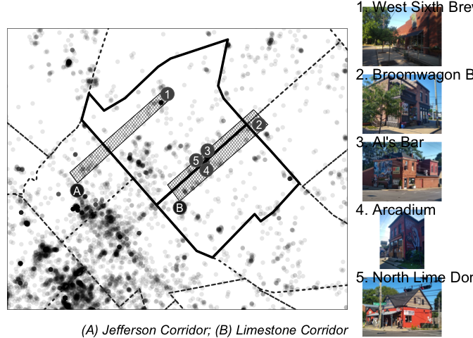
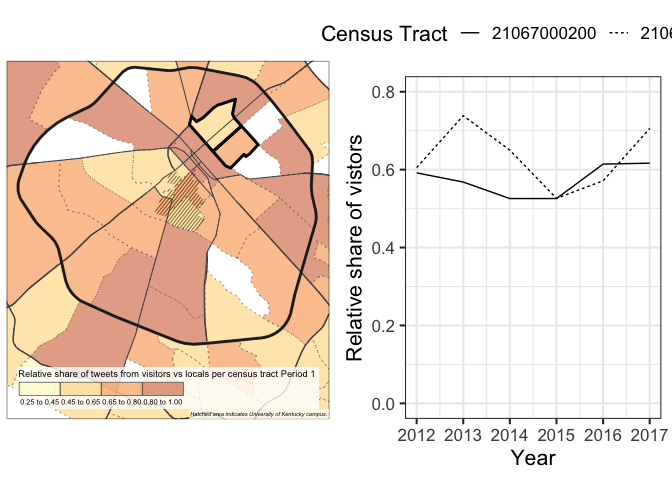
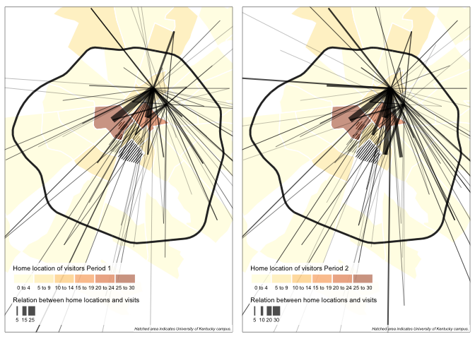
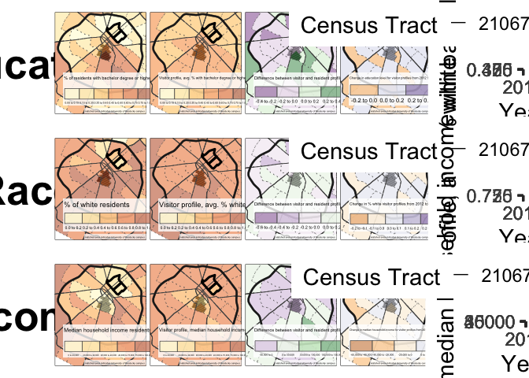

Analysis & Figures
================

## Read Data

``` r
df_homeloc <- read_rds(here("analysis/data/derived_data/lexington-2012-2018-homeloc.rds"))
df_tract <- read_rds(here("analysis/data/derived_data/lexington-2012-2018-tract.rds"))
df_user_home <- read_rds(here("analysis/data/derived_data/user_home.rds"))
df_user_home_total <- read_rds(here("analysis/data/derived_data/user_home_total.rds"))
acs_ky <- read_rds(here("analysis/data/derived_data/acs_ky.rds"))
```

## Figure Data Preparation

``` r
uni <- opq_osm_id(id = 4815526, type = "relation") %>%
  osmdata_sf() %>%
  `[[`("osm_multipolygons")

mapedit::editFeatures(st_simplify(uni), editor = "leafpm") -> uni # we edit the OSM polygon slightly to better fit the campus 'proper' boundaries
write_rds(uni, here("analysis/data/derived_data/uni.rds"))
```

``` r
streets <- opq(bbox = c(-84.6, 37.975, -84.45, 38.083)) %>%
  add_osm_feature(key = "highway", value = c("primary", "motorway", "trunk")) %>%
  osmdata_sf()

streets <- q$osm_lines %>%
  filter(is.na(name) | str_detect(name, "South Upper Street", negate = T)) %>% # filter out some 'odd' streets
  filter(is.na(name) | str_detect(name, "South Limestone Street", negate = T)) %>%
  st_simplify(dTolerance = 0.0001)

newcircle <- streets %>% filter(str_detect(name, "New Circle", negate = F))

write_rds(streets, here("analysis/data/derived_data/streets.rds"))
write_rds(newcircle, here("analysis/data/derived_data/newcircle.rds"))
```

``` r
point_labels <- mapedit::drawFeatures()
point_labels %>% mutate(id = c(1, 2, 3, 4)) -> point_labels
write_rds(point_labels, here("analysis/data/derived_data/point_labels.rds"))
```

``` r
photo_points <- mapedit::drawFeatures()
photo_points %>% mutate(id = c(3, 4, 5, 1, 2)) -> photo_points
write_rds(photo_points, here("analysis/data/derived_data/photo_points.rds"))
```

``` r
corridor_points <- mapedit::drawFeatures()
corridor_points %>% mutate(id = c("A", "B")) -> corridor_points
write_rds(corridor_points, here("analysis/data/derived_data/corridor_points.rds"))
```

``` r
uni <- read_rds(here("analysis/data/derived_data/uni.rds"))
uni_hatch <- hatchedLayer(uni, pattern = "right2left", mode = "sfc", density = 1.5)
```

    ## although coordinates are longitude/latitude, st_relate_pattern assumes that they are planar

    ## although coordinates are longitude/latitude, st_intersection assumes that they are planar

``` r
streets <- read_rds(here("analysis/data/derived_data/streets.rds"))

newcircle <- read_rds(here("analysis/data/derived_data/newcircle.rds"))

point_labels <- read_rds(here("analysis/data/derived_data/point_labels.rds"))
photo_points <- read_rds(here("analysis/data/derived_data/photo_points.rds"))
corridor_points <- read_rds(here("analysis/data/derived_data/corridor_points.rds"))

lex_ring <- bb(acs_ky %>% filter(county == "21067"), xlim = c(-84.57, -84.45), ylim = c(37.970, 38.075))
```

## Figure 1

``` r
fig1_data <- df_user_home_total %>%
  group_by(homeloc) %>%
  summarise(count = n()) %>%
  left_join(acs_ky, by = c("homeloc" = "GEOID")) %>%
  filter(county == "21067") %>%
  st_as_sf()
```

    ## `summarise()` ungrouping output (override with `.groups` argument)

``` r
write_rds(fig1_data, here("analysis/data/derived_data/fig1_data.rds"))
```

``` r
fig1_data <- read_rds(here("analysis/data/derived_data/fig1_data.rds"))

fig1 <- tm_shape(uni_hatch, bbox = lex_ring) + tm_lines(col = rgb(200, 200, 200, maxColorValue = 255)) +
  tm_shape(fig1_data, bbox = lex_ring) + tm_borders(lwd = 0.8, lty = "dotted", col = rgb(50, 50, 50, maxColorValue = 255)) +
  tm_shape(streets, bbox = lex_ring) + tm_lines(col = rgb(80, 80, 80, maxColorValue = 255), lwd = 1, alpha = 1) +
  tm_shape(newcircle, bbox = lex_ring) + tm_lines(col = rgb(30, 30, 30, maxColorValue = 255), lwd = 2.5, alpha = 0.9) +
  tm_shape(point_labels) + tm_bubbles(col = rgb(80, 80, 80, maxColorValue = 255)) + tm_text(text = "id", col = "white") +
  tm_credits("Hatched area indicates University of Kentucky campus.",
    position = c(0.99, 0.01), size = 0.7,
    just = c("right", "bottom"),
    fontface = "italic",
    bg.color = "white",
    bg.alpha = 0.7
  )

fig1
```

<!-- -->

``` r
# tmap_save(fig1, filename = "Figure1.png", width = 5)
```

## Figure 2

``` r
fig2a <- tm_shape(uni_hatch, bbox = lex_ring) + tm_lines(col = rgb(20, 20, 20, maxColorValue = 255)) +
  tm_shape(fig1_data, bbox = lex_ring) + tm_fill(
    col = "count", alpha = 0.8, n = 5, legend.is.portrait = F,
    title = "Total number of home locations per census tract over entire study period"
  ) +
  tm_borders(lwd = 0.8, lty = "dotted", col = rgb(100, 100, 100, maxColorValue = 255)) +
  tm_shape(streets, bbox = lex_ring) + tm_lines(col = rgb(80, 80, 80, maxColorValue = 255), lwd = 1, alpha = 1) +
  tm_shape(newcircle, bbox = lex_ring) + tm_lines(col = rgb(30, 30, 30, maxColorValue = 255), lwd = 2.5, alpha = 0.8) +
  tm_legend(
    legend.position = c("left", "bottom"),
    legend.width = 1,
    legend.bg.color = "white",
    legend.bg.alpha = 0.8, legend.text.size = 0.7
  ) +
  tm_layout(legend.text.size = 0.5, legend.title.size = 0.7)
```

``` r
df_user_migration <- df_user_home %>%
  pivot_wider(id_cols = u_id, names_from = period, values_from = homeloc) %>%
  rename(period_1 = `1`, period_2 = `2`) %>%
  mutate(change = period_1 != period_2)

df_migration_tract <- df_user_migration %>%
  filter(change == T) %>%
  mutate(
    period_1_sorted = pmin(period_1, period_2),
    period_2_sorted = pmax(period_1, period_2)
  ) %>%
  group_by(period_1_sorted, period_2_sorted) %>%
  summarise(count = n())
```

    ## `summarise()` regrouping output by 'period_1_sorted' (override with `.groups` argument)

``` r
acs_centroids <- acs_ky %>%
  mutate(centroid = st_centroid(geometry)) %>%
  st_set_geometry(NULL) %>%
  select(GEOID, centroid) %>%
  mutate(geometry = centroid) %>%
  select(-centroid) %>%
  st_as_sf()
```

    ## Warning in st_centroid.sfc(geometry): st_centroid does not give correct
    ## centroids for longitude/latitude data

``` r
fig2b_data_lines <- df_migration_tract %>%
  left_join(acs_centroids, by = c("period_1_sorted" = "GEOID")) %>%
  left_join(acs_centroids, by = c("period_2_sorted" = "GEOID")) %>%
  rowwise() %>%
  mutate(geometry = st_combine(c(geometry.x, geometry.y))
  %>% st_cast("LINESTRING")) %>%
  select(-geometry.x, -geometry.y) %>%
  st_as_sf(crs = 4326)

df_outgoing <- df_user_migration %>%
  filter(change == T) %>%
  group_by(period_1) %>%
  summarise(count = n())
```

    ## `summarise()` ungrouping output (override with `.groups` argument)

``` r
df_incoming <- df_user_migration %>%
  filter(change == T) %>%
  group_by(period_2) %>%
  summarise(count = n())
```

    ## `summarise()` ungrouping output (override with `.groups` argument)

``` r
fig2b_data_net <- full_join(df_outgoing, df_incoming, by = c("period_1" = "period_2")) %>%
  replace(is.na(.), 0) %>%
  mutate(net = count.y - count.x) %>%
  left_join(acs_ky, by = c("period_1" = "GEOID")) %>%
  filter(county == "21067") %>%
  st_as_sf()

write_rds(fig2b_data_lines, here("analysis/data/derived_data/fig2b_data_lines.rds"))
write_rds(fig2b_data_net, here("analysis/data/derived_data/fig2b_data_net.rds"))
```

``` r
fig2b_data_net <- read_rds(here("analysis/data/derived_data/fig2b_data_net.rds"))
fig2b_data_lines <- read_rds(here("analysis/data/derived_data/fig2b_data_lines.rds"))
fig2b <- tm_shape(uni_hatch, bbox = lex_ring) + tm_lines(col = rgb(20, 20, 20, maxColorValue = 255)) +
  tm_shape(fig2b_data_net, bbox = lex_ring) + tm_fill(
    col = "net", palette = "PuOr",
    alpha = 0.6, n = 7,
    legend.is.portrait = F,
    title = "Net inflow/outflow of users that changed home location from period 1 to period 2"
  ) +
  tm_borders(lwd = 1.5, lty = "solid", col = rgb(255, 255, 255, maxColorValue = 255)) +
  tm_shape(newcircle, bbox = lex_ring) + tm_lines(col = rgb(30, 30, 30, maxColorValue = 255), lwd = 2.5, alpha = 0.8) +
  tm_legend(
    legend.position = c("left", "bottom"),
    legend.width = 1, legend.bg.color = "white", legend.bg.alpha = 0.8, legend.text.size = 0.7
  ) +
  tm_shape(fig2b_data_lines %>% filter(count > 2)) +
  tm_lines(lwd = 4, col = rgb(30, 30, 30, maxColorValue = 255), alpha = 0.1, legend.lwd.show = F) +
  tm_shape(fig2b_data_lines %>% filter(count > 2)) +
  tm_lines(lwd = "count", scale = 8, alpha = 0.7, title.lwd = "Flow of users that changed home location from period 1 to period 2") +
  tm_layout(legend.text.size = 0.5, legend.title.size = 0.7) + tm_credits("Hatched area indicates University of Kentucky campus.",
    position = c(0.999, 0.001), size = 0.35,
    just = c("right", "bottom"), fontface = "italic",
    bg.color = "white", bg.alpha = 0.7
  )

tmap_arrange(fig2a, fig2b)
```

    ## Variable(s) "net" contains positive and negative values, so midpoint is set to 0. Set midpoint = NA to show the full spectrum of the color palette.
    ## Variable(s) "net" contains positive and negative values, so midpoint is set to 0. Set midpoint = NA to show the full spectrum of the color palette.

    ## Legend labels were too wide. Therefore, legend.text.size has been set to 0.38. Increase legend.width (argument of tm_layout) to make the legend wider and therefore the labels larger.

<!-- -->

``` r
# tmap_save(tmap_arrange(fig2a, fig2b), filename = "Figure2.png", width = 9, height = 5.5)
```

## Figure 3

``` r
fig3_data_lines <- df_homeloc %>%
  filter(homeloc_total != GEOID) %>%
  mutate(
    from = pmin(homeloc_total, GEOID),
    to = pmax(homeloc_total, GEOID)
  ) %>%
  group_by(from, to) %>%
  summarise(count = n()) %>%
  left_join(acs_centroids, by = c("from" = "GEOID")) %>%
  left_join(acs_centroids, by = c("to" = "GEOID")) %>%
  rowwise() %>%
  mutate(geometry = st_combine(c(geometry.x, geometry.y))
  %>% st_cast("LINESTRING")) %>% # note that the pipe between combine and cast is nested within mutate
  select(-geometry.x, -geometry.y) %>%
  st_as_sf(crs = 4326)
```

    ## `summarise()` regrouping output by 'from' (override with `.groups` argument)

``` r
fig3_data_net <- df_homeloc %>%
  group_by(GEOID) %>%
  summarise(count = n()) %>%
  left_join(acs_ky) %>%
  filter(county == "21067") %>%
  st_as_sf()
```

    ## `summarise()` ungrouping output (override with `.groups` argument)

    ## Joining, by = "GEOID"

``` r
write_rds(fig3_data_lines, here("analysis/data/derived_data/fig3_data_lines.rds"))
write_rds(fig3_data_net, here("analysis/data/derived_data/fig3_data_net.rds"))
```

``` r
fig3_data_net <- read_rds(here("analysis/data/derived_data/fig3_data_net.rds"))
fig3_data_lines <- read_rds(here("analysis/data/derived_data/fig3_data_lines.rds"))
fig3 <- tm_shape(uni_hatch, bbox = lex_ring) + tm_lines(col = rgb(20, 20, 20, maxColorValue = 255)) +
  tm_shape(fig3_data_net) + tm_fill(
    col = "count", alpha = 0.5, n = 5, legend.is.portrait = F,
    title = "Number of visits"
  ) +
  tm_borders(lwd = 1.5, lty = "solid", col = rgb(255, 255, 255, maxColorValue = 255)) +
  tm_shape(newcircle, bbox = lex_ring) + tm_lines(col = rgb(30, 30, 30, maxColorValue = 255), lwd = 2.5, alpha = 0.8) + tm_legend(legend.position = c("left", "bottom"), legend.width = 1, legend.bg.color = "white", legend.bg.alpha = 0.8, legend.text.size = 0.7) +
  tm_shape(fig3_data_lines %>% filter(count > 2)) +
  tm_lines(lwd = "count", scale = 9, alpha = 0.7, title.lwd = "Relation between home locations and visits") + tm_layout(legend.text.size = 0.5, legend.title.size = 0.7) + tm_credits("Hatched area indicates University of Kentucky campus.", position = c(0.999, 0.001), size = 0.35, just = c("right", "bottom"), fontface = "italic", bg.color = "white", bg.alpha = 0.7)

fig3
```

<!-- -->

``` r
# tmap_save(fig3, filename = "Figure3.png", width = 5)
```

## Figure 4

``` r
fig4a_data_lines <- df_homeloc %>%
  filter(period == 1) %>%
  filter(homeloc_total != GEOID) %>%
  mutate(
    from = pmin(homeloc_total, GEOID),
    to = pmax(homeloc_total, GEOID)
  ) %>%
  group_by(from, to) %>%
  summarise(count = n()) %>%
  left_join(acs_centroids, by = c("from" = "GEOID")) %>%
  left_join(acs_centroids, by = c("to" = "GEOID")) %>%
  rowwise() %>%
  mutate(geometry = st_combine(c(geometry.x, geometry.y))
  %>% st_cast("LINESTRING")) %>% # note that the pipe between combine and cast is nested within mutate
  select(-geometry.x, -geometry.y) %>%
  st_as_sf(crs = 4326)
```

    ## `summarise()` regrouping output by 'from' (override with `.groups` argument)

``` r
fig4a_data_net <- df_homeloc %>%
  filter(period == 1) %>%
  group_by(GEOID) %>%
  summarise(count = n()) %>%
  mutate(rel_freq = count / sum(count)) %>%
  left_join(acs_ky) %>%
  filter(county == "21067") %>%
  st_as_sf()
```

    ## `summarise()` ungrouping output (override with `.groups` argument)

    ## Joining, by = "GEOID"

``` r
fig4b_data_lines <- df_homeloc %>%
  filter(period == 2) %>%
  filter(homeloc_total != GEOID) %>%
  mutate(
    from = pmin(homeloc_total, GEOID),
    to = pmax(homeloc_total, GEOID)
  ) %>%
  group_by(from, to) %>%
  summarise(count = n()) %>%
  left_join(acs_centroids, by = c("from" = "GEOID")) %>%
  left_join(acs_centroids, by = c("to" = "GEOID")) %>%
  rowwise() %>%
  mutate(geometry = st_combine(c(geometry.x, geometry.y))
  %>% st_cast("LINESTRING")) %>% # note that the pipe between combine and cast is nested within mutate
  select(-geometry.x, -geometry.y) %>%
  st_as_sf(crs = 4326)
```

    ## `summarise()` regrouping output by 'from' (override with `.groups` argument)

``` r
fig4b_data_net <- df_homeloc %>%
  filter(period == 2) %>%
  group_by(GEOID) %>%
  summarise(count = n()) %>%
  mutate(rel_freq = count / sum(count)) %>%
  left_join(acs_ky) %>%
  filter(county == "21067") %>%
  st_as_sf()
```

    ## `summarise()` ungrouping output (override with `.groups` argument)
    ## Joining, by = "GEOID"

``` r
write_rds(fig4a_data_lines, here("analysis/data/derived_data/fig4a_data_lines.rds"))
write_rds(fig4a_data_net, here("analysis/data/derived_data/fig4a_data_net.rds"))
write_rds(fig4b_data_lines, here("analysis/data/derived_data/fig4b_data_lines.rds"))
write_rds(fig4b_data_net, here("analysis/data/derived_data/fig4b_data_net.rds"))
```

``` r
fig4a_data_net <- read_rds(here("analysis/data/derived_data/fig4a_data_net.rds"))
fig4a_data_lines <- read_rds(here("analysis/data/derived_data/fig4a_data_lines.rds"))
fig4b_data_net <- read_rds(here("analysis/data/derived_data/fig4b_data_net.rds"))
fig4b_data_lines <- read_rds(here("analysis/data/derived_data/fig4b_data_lines.rds"))

fig4a <- tm_shape(uni_hatch, bbox = lex_ring) + tm_lines(col = rgb(20, 20, 20, maxColorValue = 255)) +
  tm_shape(fig4a_data_net) + tm_fill(
    col = "rel_freq", alpha = 0.5, breaks = c(0, 0.015, 0.03, 0.045, 0.08), legend.is.portrait = F,
    title = "Number of visits Period 1"
  ) +
  tm_borders(lwd = 1.5, lty = "solid", col = rgb(255, 255, 255, maxColorValue = 255)) +
  tm_shape(newcircle, bbox = lex_ring) + tm_lines(col = rgb(30, 30, 30, maxColorValue = 255), lwd = 2.5, alpha = 0.8) + tm_legend(legend.position = c("left", "bottom"), legend.width = 1, legend.bg.color = "white", legend.bg.alpha = 0.8, legend.text.size = 0.7) +
  tm_shape(fig4a_data_lines %>% filter(count > 2)) +
  tm_lines(lwd = "count", scale = 9, alpha = 0.7, lwd.legend = c(5000, 10000, 15000, 30000), title.lwd = "Relation between home locations and visits Period 1") + tm_layout(legend.text.size = 0.5, legend.title.size = 0.7)

fig4b <- tm_shape(uni_hatch, bbox = lex_ring) + tm_lines(col = rgb(20, 20, 20, maxColorValue = 255)) +
  tm_shape(fig4b_data_net) + tm_fill(
    col = "rel_freq", alpha = 0.5, breaks = c(0, 0.015, 0.03, 0.045, 0.08), legend.is.portrait = F,
    title = "Number of visits Period 2"
  ) +
  tm_borders(lwd = 1.5, lty = "solid", col = rgb(255, 255, 255, maxColorValue = 255)) +
  tm_shape(newcircle, bbox = lex_ring) + tm_lines(col = rgb(30, 30, 30, maxColorValue = 255), lwd = 2.5, alpha = 0.8) + tm_legend(legend.position = c("left", "bottom"), legend.width = 1, legend.bg.color = "white", legend.bg.alpha = 0.8, legend.text.size = 0.7) +
  tm_shape(fig4b_data_lines %>% filter(count > 2)) +
  tm_lines(lwd = "count", scale = 9, alpha = 0.7, n = 6, lwd.legend = c(5000, 10000, 15000, 30000), title.lwd = "Relation between home locations and visits Period 2") + tm_layout(legend.text.size = 0.5, legend.title.size = 0.7) + tm_credits("Hatched area indicates University of Kentucky campus.", position = c(0.999, 0.001), size = 0.35, just = c("right", "bottom"), fontface = "italic", bg.color = "white", bg.alpha = 0.7)

tmap_arrange(fig4a, fig4b)
```

<!-- -->

``` r
# tmap_save(tmap_arrange(fig4a, fig4b), filename = "Figure4.png", width = 9, height = 5.5)
```

## Figure 5

``` r
fig5a_data <- df_homeloc %>%
  filter(period == 1) %>%
  mutate(visitor = case_when(
    GEOID == homeloc_total ~ FALSE,
    GEOID != homeloc_total ~ TRUE
  )) %>%
  select(u_id, year, GEOID, visitor) %>%
  unique() %>%
  group_by(GEOID) %>%
  summarise(visitors = sum(visitor), total = n()) %>%
  mutate(
    locals = total - visitors,
    visitors_rel = visitors / total
  ) %>%
  filter(total > 100) %>%
  left_join(acs_ky) %>%
  filter(county == "21067") %>%
  st_as_sf()
```

    ## `summarise()` ungrouping output (override with `.groups` argument)

    ## Joining, by = "GEOID"

``` r
fig5b_data <- df_homeloc %>%
  filter(period == 2) %>%
  mutate(visitor = case_when(
    GEOID == homeloc_total ~ FALSE,
    GEOID != homeloc_total ~ TRUE
  )) %>%
  select(u_id, year, GEOID, visitor) %>%
  unique() %>%
  group_by(GEOID) %>%
  summarise(visitors = sum(visitor), total = n()) %>%
  mutate(
    locals = total - visitors,
    visitors_rel = visitors / total
  ) %>%
  filter(total > 100) %>%
  left_join(acs_ky) %>%
  filter(county == "21067") %>%
  st_as_sf()
```

    ## `summarise()` ungrouping output (override with `.groups` argument)
    ## Joining, by = "GEOID"

``` r
write_rds(fig5a_data, here("analysis/data/derived_data/fig5a_data.rds"))
write_rds(fig5b_data, here("analysis/data/derived_data/fig5b_data.rds"))
```

``` r
fig5a_data <- read_rds(here("analysis/data/derived_data/fig5a_data.rds"))
fig5b_data <- read_rds(here("analysis/data/derived_data/fig5b_data.rds"))

fig5a <- tm_shape(uni_hatch, bbox = lex_ring) + tm_lines(col = rgb(20, 20, 20, maxColorValue = 255)) +
  tm_shape(fig5a_data) + tm_fill(
    col = "visitors_rel", alpha = 0.5, breaks = c(0.25, 0.45, 0.65, 0.80, 1), legend.is.portrait = F,
    title = "Relative share of tweets from visitors vs locals per census tract Period 1"
  ) + tm_borders(lwd = 0.8, lty = "dotted", col = rgb(100, 100, 100, maxColorValue = 255)) + tm_shape(streets, bbox = lex_ring) + tm_lines(col = rgb(80, 80, 80, maxColorValue = 255), lwd = 1, alpha = 1) + tm_shape(newcircle, bbox = lex_ring) + tm_lines(col = rgb(30, 30, 30, maxColorValue = 255), lwd = 2.5, alpha = 0.8) + tm_legend(legend.position = c("left", "bottom"), legend.width = 1, legend.bg.color = "white", legend.bg.alpha = 0.8, legend.text.size = 0.7) + tm_layout(legend.text.size = 0.5, legend.title.size = 0.7)

fig5b <- tm_shape(uni_hatch, bbox = lex_ring) + tm_lines(col = rgb(20, 20, 20, maxColorValue = 255)) +
  tm_shape(fig5b_data) + tm_fill(
    col = "visitors_rel", alpha = 0.5, breaks = c(0.25, 0.45, 0.65, 0.80, 1), legend.is.portrait = F,
    title = "Relative share of tweets from visitors vs locals per census tract Period 2"
  ) + tm_borders(lwd = 0.8, lty = "dotted", col = rgb(100, 100, 100, maxColorValue = 255)) + tm_shape(streets, bbox = lex_ring) + tm_lines(col = rgb(80, 80, 80, maxColorValue = 255), lwd = 1, alpha = 1) + tm_shape(newcircle, bbox = lex_ring) + tm_lines(col = rgb(30, 30, 30, maxColorValue = 255), lwd = 2.5, alpha = 0.8) + tm_legend(legend.position = c("left", "bottom"), legend.width = 1, legend.bg.color = "white", legend.bg.alpha = 0.8, legend.text.size = 0.7) + tm_layout(legend.text.size = 0.5, legend.title.size = 0.7) + tm_credits("Hatched area indicates University of Kentucky campus.", position = c(0.999, 0.001), size = 0.35, just = c("right", "bottom"), fontface = "italic", bg.color = "white", bg.alpha = 0.7)

tmap_arrange(fig5a, fig5b)
```

<!-- -->

``` r
# tmap_save(tmap_arrange(fig5a, fig5b), filename = "Figure5.png", width = 9, height = 5.5)
```

## Figure 6

``` r
fig6_data <- df_tract %>%
  filter(GEOID == "21067000200" | GEOID == "21067000300" | GEOID == "21067000102" | GEOID == "21067000101" | GEOID == "21067001100" | GEOID == "21067001300" | GEOID == "21067001400" | GEOID == "21067001500" | GEOID == "21067000900" | GEOID == "21067000802" | GEOID == "21067000400" | GEOID == "21067000500" | GEOID == "21067000600" | GEOID == "21067001000" | GEOID == "21067001600") %>%
  sample_n(15000) %>%
  select(geometry)

write_rds(fig6_data, here("analysis/data/derived_data/fig6_data.rds"))
```

``` r
fig6_data <- read_rds(here("analysis/data/derived_data/fig6_data.rds"))

sf_jefferson <- st_sfc(st_polygon(list(rbind(c(-84.502212, 38.051646), c(-84.490479, 38.060039), c(-84.491444, 38.060749), c(-84.503174, 38.052664), c(-84.502212, 38.051646)))), crs = 4326)
sf_limestone <- st_sfc(st_polygon(list(rbind(c(-84.489722, 38.049897), c(-84.478923, 38.057284), c(-84.480680, 38.058719), c(-84.491205, 38.051473), c(-84.489722, 38.049897)))), crs = 4326)

jefferson_hatch <- hatchedLayer(sf_jefferson, pattern = "diamond", mode = "sfc", density = 2.5)
```

    ## although coordinates are longitude/latitude, st_relate_pattern assumes that they are planar

    ## although coordinates are longitude/latitude, st_union assumes that they are planar

    ## although coordinates are longitude/latitude, st_intersection assumes that they are planar

``` r
limestone_hatch <- hatchedLayer(sf_limestone, pattern = "diamond", mode = "sfc", density = 2.5)
```

    ## although coordinates are longitude/latitude, st_relate_pattern assumes that they are planar

    ## although coordinates are longitude/latitude, st_union assumes that they are planar

    ## although coordinates are longitude/latitude, st_intersection assumes that they are planar

``` r
northside <- bb(acs_ky %>% filter(county == "21067"), xlim = c(-84.51, -84.47), ylim = c(38.04, 38.066))

fig6 <- tm_shape(jefferson_hatch, bbox = northside) + tm_lines(lwd = 1, alpha = 0.4, lty = "solid", col = "black") +
  tm_shape(sf_jefferson) + tm_borders(col = "black") +
  tm_shape(limestone_hatch) + tm_lines(lwd = 1, alpha = 0.4, lty = "solid", col = "black") +
  tm_shape(sf_limestone) + tm_borders(col = "black") +
  tm_shape(fig6_data, bbox = northside) + tm_dots(alpha = 0.1, size = 0.2) +
  tm_shape(acs_ky %>% filter(county == "21067"), bbox = northside) + tm_borders(lwd = 2.2, lty = "dotted", col = rgb(50, 50, 50, maxColorValue = 255)) +
  tm_shape(acs_ky %>% filter(GEOID == "21067000200" | GEOID == "21067000300")) + tm_borders(lwd = 3.5, col = "black") + tm_shape(photo_points) + tm_bubbles(col = rgb(80, 80, 80, maxColorValue = 255)) + tm_text(text = "id", col = "white") + tm_shape(corridor_points) + tm_bubbles(col = rgb(30, 30, 30, maxColorValue = 255)) + tm_text(text = "id", col = "white")

img <- image_read(here("analysis/data/raw_data/photos/IMG_20200718_092204647.jpg")) %>%
  image_resize(geometry = "30%")
ggdraw() + draw_image(img, x = 0.9, y = 0.9, hjust = 1, vjust = 1, height = 0.88) + draw_plot_label("1. West Sixth Brewing", fontface = "plain", x = 0.01, y = 0.99, hjust = 0, vjust = 1, size = 16) -> img1

img <- image_read(here("analysis/data/raw_data/photos/IMG_20200718_091236847_HDR.jpg")) %>%
  image_resize(geometry = "30%")
ggdraw() + draw_image(img, x = 0.9, y = 0.9, hjust = 1, vjust = 1, height = 0.88) + draw_plot_label("2. Broomwagon Bikes + Cafe", fontface = "plain", x = 0.01, y = 0.99, hjust = 0, vjust = 1, size = 16) -> img2

img <- image_read(here("analysis/data/raw_data/photos/IMG_20200718_090358888_HDR.jpg")) %>%
  image_resize(geometry = "30%")
ggdraw() + draw_image(img, x = 0.9, y = 0.9, hjust = 1, vjust = 1, height = 0.88) + draw_plot_label("3. Al's Bar", fontface = "plain", x = 0.01, y = 0.99, hjust = 0, vjust = 1, size = 16) -> img3

img <- image_read(here("analysis/data/raw_data/photos/IMG_20200718_090624097_HDR.jpg")) %>%
  image_resize(geometry = "30%")
ggdraw() + draw_image(img, x = 0.9, y = 0.9, hjust = 1, vjust = 1, height = 0.88) + draw_plot_label("4. Arcadium", fontface = "plain", x = 0.01, y = 0.99, hjust = 0, vjust = 1, size = 16) -> img4

img <- image_read(here("analysis/data/raw_data/photos/IMG_20200718_090440049_HDR.jpg")) %>%
  image_resize(geometry = "30%")
ggdraw() + draw_image(img, x = 0.9, y = 0.9, hjust = 1, vjust = 1, height = 0.88) + draw_plot_label("5. North Lime Donuts", fontface = "plain", x = 0.01, y = 0.99, hjust = 0, vjust = 1, size = 16) -> img5


# png("Figure6.png", width = 2000, height = 1300, pointsize = 20)

grid.newpage()
pushViewport(viewport(layout = grid.layout(ncol = 2, nrow = 5, widths = c(3, 1))))
print(fig6, vp = viewport(layout.pos.col = 1))
grid.text("(A) Jefferson Corridor; (B) Limestone Corridor", x = 0.98, y = 0.04, just = c(1, 1), gp = gpar(fontsize = 14, fontface = "italic"), vp = viewport(layout.pos.col = 1))
print(img1, vp = viewport(layout.pos.col = 2, layout.pos.row = 1))
print(img2, vp = viewport(layout.pos.col = 2, layout.pos.row = 2))
print(img3, vp = viewport(layout.pos.col = 2, layout.pos.row = 3))
print(img4, vp = viewport(layout.pos.col = 2, layout.pos.row = 4))
print(img5, vp = viewport(layout.pos.col = 2, layout.pos.row = 5))
```

<!-- -->

``` r
# dev.off()
```

## Figure 7

``` r
fig7a_data <- df_homeloc %>%
  filter(period == 1) %>%
  mutate(visitor = case_when(
    GEOID == homeloc_total ~ FALSE,
    GEOID != homeloc_total ~ TRUE
  )) %>%
  select(u_id, year, GEOID, visitor) %>%
  unique() %>%
  group_by(GEOID) %>%
  summarise(visitors = sum(visitor), total = n()) %>%
  mutate(
    locals = total - visitors,
    visitors_rel = visitors / total
  ) %>%
  filter(total > 100) %>%
  left_join(acs_ky) %>%
  filter(county == "21067") %>%
  st_as_sf()
```

    ## `summarise()` ungrouping output (override with `.groups` argument)

    ## Joining, by = "GEOID"

``` r
fig7b_data <- df_homeloc %>%
  mutate(visitor = case_when(
    GEOID == homeloc_total ~ FALSE,
    GEOID != homeloc_total ~ TRUE
  )) %>%
  select(u_id, year, GEOID, visitor) %>%
  unique() %>%
  group_by(GEOID, year) %>%
  summarise(visitors = sum(visitor), total = n()) %>%
  mutate(
    locals = total - visitors,
    visitors_rel = visitors / total
  ) %>%
  mutate(county = substr(GEOID, start = 1, stop = 5)) %>%
  filter(GEOID == "21067000200" | GEOID == "21067000300")
```

    ## `summarise()` regrouping output by 'GEOID' (override with `.groups` argument)

``` r
write_rds(fig7a_data, here("analysis/data/derived_data/fig7a_data.rds"))
write_rds(fig7b_data, here("analysis/data/derived_data/fig7b_data.rds"))
```

``` r
fig7a_data <- read_rds(here("analysis/data/derived_data/fig7a_data.rds"))
fig7b_data <- read_rds(here("analysis/data/derived_data/fig7b_data.rds"))

fig7a <- tm_shape(uni_hatch, bbox = lex_ring) + tm_lines(col = rgb(20, 20, 20, maxColorValue = 255)) +
  tm_shape(fig7a_data) + tm_fill(
    col = "visitors_rel", alpha = 0.5, breaks = c(0.25, 0.45, 0.65, 0.80, 1), legend.is.portrait = F,
    title = "Relative share of tweets from visitors vs locals per census tract Period 1"
  ) + tm_borders(lwd = 0.8, lty = "dotted", col = rgb(100, 100, 100, maxColorValue = 255)) + tm_shape(streets, bbox = lex_ring) + tm_lines(col = rgb(80, 80, 80, maxColorValue = 255), lwd = 1, alpha = 1) + tm_shape(newcircle, bbox = lex_ring) + tm_lines(col = rgb(30, 30, 30, maxColorValue = 255), lwd = 2.5, alpha = 0.8) + tm_shape(acs_ky %>% filter(GEOID == "21067000200" | GEOID == "21067000300")) + tm_borders(lwd = 3, col = "black") + tm_legend(legend.position = c("left", "bottom"), legend.width = 1, legend.bg.color = "white", legend.bg.alpha = 0.8, legend.text.size = 0.7) + tm_layout(legend.text.size = 0.5, legend.title.size = 0.7) + tm_credits("Hatched area indicates University of Kentucky campus.", position = c(0.999, 0.001), size = 0.35, just = c("right", "bottom"), fontface = "italic", bg.color = "white", bg.alpha = 0.7)

fig7b <- fig7b_data %>%
  ggplot(aes(x = year, y = visitors_rel, group = GEOID)) +
  geom_line(aes(linetype = GEOID)) +
  ylim(0, 0.8) +
  theme_bw(base_size = 16) +
  theme(legend.position = "top") +
  labs(x = "Year", y = "Relative share of vistors", linetype = "Census Tract")

# png("Figure7.png", width = 2000, height = 1050, pointsize = 30)
grid.newpage()
pushViewport(viewport(layout = grid.layout(ncol = 2, nrow = 1)))
print(fig7a, vp = viewport(layout.pos.col = 1))
print(fig7b, vp = viewport(layout.pos.col = 2))
```

<!-- -->

``` r
# dev.off()
```

## Figure 8

``` r
fig8a_data_lines <- df_homeloc %>%
  filter(period == 1) %>%
  filter(homeloc_total != GEOID) %>%
  filter(GEOID == "21067000200" | GEOID == "21067000300") %>%
  mutate(
    from = pmin(homeloc_total, GEOID),
    to = pmax(homeloc_total, GEOID)
  ) %>%
  select(u_id, year, from, to) %>%
  unique() %>%
  group_by(from, to) %>%
  summarise(count = n()) %>%
  left_join(acs_centroids, by = c("from" = "GEOID")) %>%
  left_join(acs_centroids, by = c("to" = "GEOID")) %>%
  rowwise() %>%
  mutate(geometry = st_combine(c(geometry.x, geometry.y))
  %>% st_cast("LINESTRING")) %>% # note that the pipe between combine and cast is nested within mutate
  select(-geometry.x, -geometry.y) %>%
  st_as_sf(crs = 4326)
```

    ## `summarise()` regrouping output by 'from' (override with `.groups` argument)

``` r
fig8a_data_net <- df_homeloc %>%
  filter(period == 1) %>%
  filter(homeloc_total != GEOID) %>%
  filter(GEOID == "21067000200" | GEOID == "21067000300") %>%
  select(u_id, year, homeloc_total) %>%
  unique() %>%
  group_by(homeloc_total) %>%
  summarise(count = n()) %>%
  left_join(acs_ky, by = c("homeloc_total" = "GEOID")) %>%
  filter(county == "21067") %>%
  st_as_sf()
```

    ## `summarise()` ungrouping output (override with `.groups` argument)

``` r
fig8b_data_lines <- df_homeloc %>%
  filter(period == 2) %>%
  filter(homeloc_total != GEOID) %>%
  filter(GEOID == "21067000200" | GEOID == "21067000300") %>%
  mutate(
    from = pmin(homeloc_total, GEOID),
    to = pmax(homeloc_total, GEOID)
  ) %>%
  select(u_id, year, from, to) %>%
  unique() %>%
  group_by(from, to) %>%
  summarise(count = n()) %>%
  left_join(acs_centroids, by = c("from" = "GEOID")) %>%
  left_join(acs_centroids, by = c("to" = "GEOID")) %>%
  rowwise() %>%
  mutate(geometry = st_combine(c(geometry.x, geometry.y))
  %>% st_cast("LINESTRING")) %>% # note that the pipe between combine and cast is nested within mutate
  select(-geometry.x, -geometry.y) %>%
  st_as_sf(crs = 4326)
```

    ## `summarise()` regrouping output by 'from' (override with `.groups` argument)

``` r
fig8b_data_net <- df_homeloc %>%
  filter(period == 2) %>%
  filter(homeloc_total != GEOID) %>%
  filter(GEOID == "21067000200" | GEOID == "21067000300") %>%
  select(u_id, year, homeloc_total) %>%
  unique() %>%
  group_by(homeloc_total) %>%
  summarise(count = n()) %>%
  left_join(acs_ky, by = c("homeloc_total" = "GEOID")) %>%
  filter(county == "21067") %>%
  st_as_sf()
```

    ## `summarise()` ungrouping output (override with `.groups` argument)

``` r
write_rds(fig8a_data_lines, here("analysis/data/derived_data/fig8a_data_lines.rds"))
write_rds(fig8a_data_net, here("analysis/data/derived_data/fig8a_data_net.rds"))
write_rds(fig8b_data_lines, here("analysis/data/derived_data/fig8b_data_lines.rds"))
write_rds(fig8b_data_net, here("analysis/data/derived_data/fig8b_data_net.rds"))
```

``` r
fig8a_data_net <- read_rds(here("analysis/data/derived_data/fig8a_data_net.rds"))
fig8a_data_lines <- read_rds(here("analysis/data/derived_data/fig8a_data_lines.rds"))
fig8b_data_net <- read_rds(here("analysis/data/derived_data/fig8b_data_net.rds"))
fig8b_data_lines <- read_rds(here("analysis/data/derived_data/fig8b_data_lines.rds"))

tm_shape(uni_hatch, bbox = lex_ring) + tm_lines(col = rgb(20, 20, 20, maxColorValue = 255)) +
  tm_shape(fig8a_data_net) + tm_fill(
    col = "count", alpha = 0.5, breaks = c(0, 5, 10, 15, 20, 25, 30), legend.is.portrait = F,
    title = "Home location of visitors Period 1"
  ) +
  tm_borders(lwd = 1.5, lty = "solid", col = rgb(255, 255, 255, maxColorValue = 255)) +
  tm_shape(newcircle, bbox = lex_ring) + tm_lines(col = rgb(30, 30, 30, maxColorValue = 255), lwd = 2.5, alpha = 0.8) + tm_legend(legend.position = c("left", "bottom"), legend.width = 1, legend.bg.color = "white", legend.bg.alpha = 0.8, legend.text.size = 0.7) +
  tm_shape(fig8a_data_lines %>% filter(count > 0)) +
  tm_lines(lwd = "count", scale = 9, alpha = 0.7, title.lwd = "Relation between home locations and visits") + tm_layout(legend.text.size = 0.5, legend.title.size = 0.7) + tm_credits("Hatched area indicates University of Kentucky campus.", position = c(0.999, 0.001), size = 0.35, just = c("right", "bottom"), fontface = "italic", bg.color = "white", bg.alpha = 0.7) -> fig8a

tm_shape(uni_hatch, bbox = lex_ring) + tm_lines(col = rgb(20, 20, 20, maxColorValue = 255)) +
  tm_shape(fig8a_data_net) + tm_fill(
    col = "count", alpha = 0.5, breaks = c(0, 5, 10, 15, 20, 25, 30), legend.is.portrait = F,
    title = "Home location of visitors Period 2"
  ) +
  tm_borders(lwd = 1.5, lty = "solid", col = rgb(255, 255, 255, maxColorValue = 255)) + # tm_shape(streets, bbox = lex_ring) + tm_lines(col = rgb(80, 80, 80, maxColorValue = 255), lwd = 1, alpha = 1) +
  tm_shape(newcircle, bbox = lex_ring) + tm_lines(col = rgb(30, 30, 30, maxColorValue = 255), lwd = 2.5, alpha = 0.8) + tm_legend(legend.position = c("left", "bottom"), legend.width = 1, legend.bg.color = "white", legend.bg.alpha = 0.8, legend.text.size = 0.7) +
  tm_shape(fig8b_data_lines %>% filter(count > 0)) +
  tm_lines(lwd = "count", scale = 9, alpha = 0.7, title.lwd = "Relation between home locations and visits") + tm_layout(legend.text.size = 0.5, legend.title.size = 0.7) + tm_credits("Hatched area indicates University of Kentucky campus.", position = c(0.999, 0.001), size = 0.35, just = c("right", "bottom"), fontface = "italic", bg.color = "white", bg.alpha = 0.7) -> fig8b

tmap_arrange(fig8a, fig8b)
```

<!-- -->

``` r
# tmap_save(tmap_arrange(fig8a, fig8b), filename = "Figure8.png", width = 9, height = 5.5)
```

## Figure 9

### Education

Panel 1

``` r
acs_education <- get_acs(
  state = "KY", geography = "tract",
  variables = c(no_schooling = "B15003_002", nursery_school = "B15003_003", kindergarten = "B15003_004", grade_1 = "B15003_005", grade_2 = "B15003_006", grade_3 = "B15003_007", grade_4 = "B15003_008", grade_5 = "B15003_009", grade_6 = "B15003_010", grade_7 = "B15003_011", grade_8 = "B15003_012", grade_9 = "B15003_013", grade_10 = "B15003_014", grade_11 = "B15003_015", grade_12 = "B15003_016", diploma = "B15003_017", ced_credential = "B15003_018", college_less_one_year = "B15003_019", college_more_one_year = "B15003_020", associate_degree = "B15003_021", bachelor_degree = "B15003_022", master_degree = "B15003_023", professional_degree = "B15003_024", doctorate_degree = "B15003_025"),
  geometry = T, year = 2016
) %>%
  st_transform(., "+init=epsg:4326")

write_rds(acs_education, here("analysis/data/derived_data/acs_education.rds"))
```

``` r
acs_education <- read_rds(here("analysis/data/derived_data/acs_education.rds"))
acs_education_percent <- acs_education %>%
  st_set_geometry(NULL) %>%
  select(GEOID, variable, estimate) %>%
  group_by(GEOID) %>%
  mutate(
    total = sum(estimate),
    percent = estimate / total
  ) %>%
  filter(variable %in% c("bachelor_degree", "master_degree", "professional_degree", "doctorate_degree")) %>%
  summarise(bachelor_gt_percent = sum(percent)) %>%
  left_join(., (acs_education %>% select(GEOID) %>% unique()), by = c("GEOID")) %>%
  select(-geometry)
```

    ## `summarise()` ungrouping output (override with `.groups` argument)

``` r
fig9p1 <- tm_shape(uni_hatch, bbox = lex_ring) + tm_lines(col = rgb(20, 20, 20, maxColorValue = 255)) +
  acs_education_percent %>%
  left_join(acs_ky) %>%
  filter(county == "21067") %>%
  st_as_sf() %>%
  tm_shape() + tm_fill(
    col = "bachelor_gt_percent", alpha = 0.5, breaks = c(0, 0.15, 0.3, 0.45, 0.6, 0.75, 1), legend.is.portrait = F,
    title = "% of residents with bachelor degree or higher"
  ) + tm_borders(lwd = 0.8, lty = "dotted", col = rgb(100, 100, 100, maxColorValue = 255)) + tm_shape(streets, bbox = lex_ring) + tm_lines(col = rgb(80, 80, 80, maxColorValue = 255), lwd = 1, alpha = 1) + tm_shape(newcircle, bbox = lex_ring) + tm_lines(col = rgb(30, 30, 30, maxColorValue = 255), lwd = 2.5, alpha = 0.8) + tm_shape(acs_ky %>% filter(GEOID == "21067000200" | GEOID == "21067000300")) + tm_borders(lwd = 3, col = "black") + tm_legend(legend.position = c("left", "bottom"), legend.width = 1, legend.bg.color = "white", legend.bg.alpha = 0.8, legend.text.size = 0.7) + tm_layout(legend.text.size = 0.5, legend.title.size = 0.7) + tm_credits("Hatched area indicates University of Kentucky campus.", position = c(0.999, 0.001), size = 0.35, just = c("right", "bottom"), fontface = "italic", bg.color = "white", bg.alpha = 0.7)
```

    ## Joining, by = "GEOID"

Panel 2 & 3

``` r
education_visitors <- df_homeloc %>%
  left_join(acs_education_percent, by = c("homeloc_total" = "GEOID")) %>%
  filter(homeloc_total != GEOID) %>%
  select(u_id, year, homeloc_total, bachelor_gt_percent, GEOID) %>%
  unique() %>%
  group_by(GEOID) %>%
  summarise(bachelor_gt_percent_mean = mean(bachelor_gt_percent)) %>%
  left_join(acs_ky) %>%
  filter(county == "21067") %>%
  st_as_sf()
```

    ## `summarise()` ungrouping output (override with `.groups` argument)

    ## Joining, by = "GEOID"

``` r
write_rds(education_visitors, here("analysis/data/derived_data/education_visitors.rds"))
```

``` r
education_visitors <- read_rds(here("analysis/data/derived_data/education_visitors.rds"))

fig9p2 <- tm_shape(uni_hatch, bbox = lex_ring) + tm_lines(col = rgb(20, 20, 20, maxColorValue = 255)) +
  tm_shape(education_visitors) + tm_fill(
    col = "bachelor_gt_percent_mean", alpha = 0.5, breaks = c(0, 0.15, 0.3, 0.45, 0.6, 0.75, 1), legend.is.portrait = F,
    title = "Visitor profile, avg. % with bachelor degree or higher"
  ) + tm_borders(lwd = 0.8, lty = "dotted", col = rgb(100, 100, 100, maxColorValue = 255)) + tm_shape(streets, bbox = lex_ring) + tm_lines(col = rgb(80, 80, 80, maxColorValue = 255), lwd = 1, alpha = 1) + tm_shape(newcircle, bbox = lex_ring) + tm_lines(col = rgb(30, 30, 30, maxColorValue = 255), lwd = 2.5, alpha = 0.8) + tm_shape(acs_ky %>% filter(GEOID == "21067000200" | GEOID == "21067000300")) + tm_borders(lwd = 3, col = "black") + tm_legend(legend.position = c("left", "bottom"), legend.width = 1, legend.bg.color = "white", legend.bg.alpha = 0.8, legend.text.size = 0.7) + tm_layout(legend.text.size = 0.5, legend.title.size = 0.7) + tm_credits("Hatched area indicates University of Kentucky campus.", position = c(0.999, 0.001), size = 0.35, just = c("right", "bottom"), fontface = "italic", bg.color = "white", bg.alpha = 0.7)

fig9p3 <- tm_shape(uni_hatch, bbox = lex_ring) + tm_lines(col = rgb(20, 20, 20, maxColorValue = 255)) +
  acs_education_percent %>%
  left_join(acs_ky) %>%
  filter(county == "21067") %>%
  st_as_sf() %>%
  left_join(education_visitors %>% st_set_geometry(NULL), by = "GEOID") %>%
  mutate(education_diff = bachelor_gt_percent - bachelor_gt_percent_mean) %>%
  tm_shape() + tm_fill(
    col = "education_diff", alpha = 0.5, n = 3, palette = "PRGn", legend.is.portrait = F,
    title = "Difference between visitor and resident profile"
  ) + tm_borders(lwd = 0.8, lty = "dotted", col = rgb(100, 100, 100, maxColorValue = 255)) + tm_shape(streets, bbox = lex_ring) + tm_lines(col = rgb(80, 80, 80, maxColorValue = 255), lwd = 1, alpha = 1) + tm_shape(newcircle, bbox = lex_ring) + tm_lines(col = rgb(30, 30, 30, maxColorValue = 255), lwd = 2.5, alpha = 0.8) + tm_shape(acs_ky %>% filter(GEOID == "21067000200" | GEOID == "21067000300")) + tm_borders(lwd = 3, col = "black") + tm_legend(legend.position = c("left", "bottom"), legend.width = 1, legend.bg.color = "white", legend.bg.alpha = 0.8, legend.text.size = 0.7) + tm_layout(legend.text.size = 0.5, legend.title.size = 0.7) + tm_credits("Hatched area indicates University of Kentucky campus.", position = c(0.999, 0.001), size = 0.35, just = c("right", "bottom"), fontface = "italic", bg.color = "white", bg.alpha = 0.7)
```

    ## Joining, by = "GEOID"

Panel 4 & 5

``` r
education_change <- df_homeloc %>%
  left_join(acs_education_percent, by = c("homeloc_total" = "GEOID")) %>%
  filter(homeloc_total != GEOID) %>%
  select(u_id, year, homeloc_total, bachelor_gt_percent, GEOID) %>%
  unique() %>%
  group_by(GEOID, year) %>%
  summarise(bachelor_gt_percent_mean = mean(bachelor_gt_percent)) %>%
  ungroup() %>%
  mutate(county = substr(GEOID, start = 1, stop = 5)) %>%
  filter(county == "21067") %>%
  filter(year == 2012 | year == 2017) %>%
  pivot_wider(id_cols = GEOID, names_from = year, values_from = bachelor_gt_percent_mean) %>%
  rename(
    education_2012 = `2012`,
    education_2017 = `2017`
  ) %>%
  mutate(change = education_2017 - education_2012) %>%
  filter(!is.na(change))
```

    ## `summarise()` regrouping output by 'GEOID' (override with `.groups` argument)

``` r
visitors_per_tract <- df_homeloc %>%
  select(u_id, year, GEOID) %>%
  unique() %>%
  group_by(GEOID) %>%
  count()

fig9p4_data <- education_change %>%
  left_join(visitors_per_tract) %>%
  filter(n > 100) %>%
  left_join(acs_ky) %>%
  filter(county == "21067") %>%
  st_as_sf()
```

    ## Joining, by = "GEOID"

    ## Joining, by = "GEOID"

``` r
fig9p5_data <- df_homeloc %>%
  left_join(acs_education_percent, by = c("homeloc_total" = "GEOID")) %>%
  filter(homeloc_total != GEOID) %>%
  select(u_id, year, homeloc_total, bachelor_gt_percent, GEOID) %>%
  unique() %>%
  group_by(GEOID, year) %>%
  summarise(bachelor_gt_percent_mean = mean(bachelor_gt_percent)) %>%
  ungroup() %>%
  mutate(county = substr(GEOID, start = 1, stop = 5)) %>%
  filter(county == "21067") %>%
  filter(GEOID == "21067000200" | GEOID == "21067000300")
```

    ## `summarise()` regrouping output by 'GEOID' (override with `.groups` argument)

``` r
write_rds(fig9p4_data, here("analysis/data/derived_data/fig9p4_data.rds"))
write_rds(fig9p5_data, here("analysis/data/derived_data/fig9p5_data.rds"))
```

``` r
fig9p4_data <- read_rds(here("analysis/data/derived_data/fig9p4_data.rds"))
fig9p5_data <- read_rds(here("analysis/data/derived_data/fig9p5_data.rds"))

fig9p4 <- tm_shape(uni_hatch, bbox = lex_ring) + tm_lines(col = rgb(20, 20, 20, maxColorValue = 255)) +
  tm_shape(fig9p4_data) + tm_fill(
    col = "change", alpha = 0.5, n = 3, palette = "PuOr", legend.is.portrait = F,
    title = "Change in education level for visitor profiles from 2012 to 2017"
  ) + tm_borders(lwd = 0.8, lty = "dotted", col = rgb(100, 100, 100, maxColorValue = 255)) + tm_shape(streets, bbox = lex_ring) + tm_lines(col = rgb(80, 80, 80, maxColorValue = 255), lwd = 1, alpha = 1) + tm_shape(newcircle, bbox = lex_ring) + tm_lines(col = rgb(30, 30, 30, maxColorValue = 255), lwd = 2.5, alpha = 0.8) + tm_shape(acs_ky %>% filter(GEOID == "21067000200" | GEOID == "21067000300")) + tm_borders(lwd = 3, col = "black") + tm_legend(legend.position = c("left", "bottom"), legend.width = 1, legend.bg.color = "white", legend.bg.alpha = 0.8, legend.text.size = 0.7) + tm_layout(legend.text.size = 0.5, legend.title.size = 0.7) + tm_credits("Hatched area indicates University of Kentucky campus.", position = c(0.999, 0.001), size = 0.35, just = c("right", "bottom"), fontface = "italic", bg.color = "white", bg.alpha = 0.7)

fig9p5 <- ggplot(fig9p5_data, aes(x = year, y = bachelor_gt_percent_mean, group = GEOID)) +
  geom_line(aes(linetype = GEOID)) +
  theme_bw(base_size = 22) +
  theme(legend.position = "top") +
  labs(x = "Year", y = "Visitor profile, avg. % with bachelor degree or higher", linetype = "Census Tract")
```

### Race

Panel 1

``` r
acs_race <- get_acs(
  state = "KY", geography = "tract",
  variables = c(white_alone = "B02001_002", black_african_america = "B02001_003", american_indian = "B02001_004", asian = "B02001_005", native_hawaiian = "B02001_006", other_race = "B02001_007", two_more_race = "B02001_008"),
  geometry = T, year = 2016
) %>%
  st_transform(., "+init=epsg:4326")

write_rds(acs_race, here("analysis/data/derived_data/acs_race.rds"))
```

``` r
acs_race <- read_rds(here("analysis/data/derived_data/acs_race.rds"))

acs_race_percent <- acs_race %>%
  st_set_geometry(NULL) %>%
  select(GEOID, variable, estimate) %>%
  group_by(GEOID) %>%
  mutate(
    total = sum(estimate),
    percent = estimate / total
  ) %>%
  filter(variable %in% c("white_alone")) %>%
  summarise(white_percentage = sum(percent)) %>%
  left_join(., (acs_race %>% select(GEOID) %>% unique()), by = c("GEOID")) %>%
  select(-geometry)
```

    ## `summarise()` ungrouping output (override with `.groups` argument)

``` r
fig10p1 <- tm_shape(uni_hatch, bbox = lex_ring) + tm_lines(col = rgb(20, 20, 20, maxColorValue = 255)) +
  acs_race_percent %>%
  left_join(acs_ky) %>%
  filter(county == "21067") %>%
  st_as_sf() %>%
  tm_shape() + tm_fill(
    col = "white_percentage", alpha = 0.5, breaks = c(0, 0.2, 0.4, 0.6, 0.8, 1), legend.is.portrait = F,
    title = "% of white residents"
  ) + tm_borders(lwd = 0.8, lty = "dotted", col = rgb(100, 100, 100, maxColorValue = 255)) + tm_shape(streets, bbox = lex_ring) + tm_lines(col = rgb(80, 80, 80, maxColorValue = 255), lwd = 1, alpha = 1) + tm_shape(newcircle, bbox = lex_ring) + tm_lines(col = rgb(30, 30, 30, maxColorValue = 255), lwd = 2.5, alpha = 0.8) + tm_shape(acs_ky %>% filter(GEOID == "21067000200" | GEOID == "21067000300")) + tm_borders(lwd = 3, col = "black") + tm_legend(legend.position = c("left", "bottom"), legend.width = 1, legend.bg.color = "white", legend.bg.alpha = 0.8, legend.text.size = 0.7) + tm_layout(legend.text.size = 0.5, legend.title.size = 0.7) + tm_credits("Hatched area indicates University of Kentucky campus.", position = c(0.999, 0.001), size = 0.35, just = c("right", "bottom"), fontface = "italic", bg.color = "white", bg.alpha = 0.7)
```

    ## Joining, by = "GEOID"

Panel 2 & 3

``` r
race_visitors <- df_homeloc %>%
  left_join(acs_race_percent, by = c("homeloc_total" = "GEOID")) %>%
  filter(homeloc_total != GEOID) %>%
  select(u_id, year, homeloc_total, white_percentage, GEOID) %>%
  unique() %>%
  group_by(GEOID) %>%
  summarise(white_percentage_visitors = mean(white_percentage)) %>%
  left_join(acs_ky) %>%
  filter(county == "21067") %>%
  st_as_sf()
```

    ## `summarise()` ungrouping output (override with `.groups` argument)

    ## Joining, by = "GEOID"

``` r
write_rds(race_visitors, here("analysis/data/derived_data/race_visitors.rds"))
```

``` r
race_visitors <- read_rds(here("analysis/data/derived_data/race_visitors.rds"))


fig10p2 <- tm_shape(uni_hatch, bbox = lex_ring) + tm_lines(col = rgb(20, 20, 20, maxColorValue = 255)) +
  tm_shape(race_visitors) + tm_fill(
    col = "white_percentage_visitors", alpha = 0.5, breaks = c(0, 0.2, 0.4, 0.6, 0.8, 1), legend.is.portrait = F,
    title = "Visitor profile, avg. % white"
  ) + tm_borders(lwd = 0.8, lty = "dotted", col = rgb(100, 100, 100, maxColorValue = 255)) + tm_shape(streets, bbox = lex_ring) + tm_lines(col = rgb(80, 80, 80, maxColorValue = 255), lwd = 1, alpha = 1) + tm_shape(newcircle, bbox = lex_ring) + tm_lines(col = rgb(30, 30, 30, maxColorValue = 255), lwd = 2.5, alpha = 0.8) + tm_shape(acs_ky %>% filter(GEOID == "21067000200" | GEOID == "21067000300")) + tm_borders(lwd = 3, col = "black") + tm_legend(legend.position = c("left", "bottom"), legend.width = 1, legend.bg.color = "white", legend.bg.alpha = 0.8, legend.text.size = 0.7) + tm_layout(legend.text.size = 0.5, legend.title.size = 0.7) + tm_credits("Hatched area indicates University of Kentucky campus.", position = c(0.999, 0.001), size = 0.35, just = c("right", "bottom"), fontface = "italic", bg.color = "white", bg.alpha = 0.7)

fig10p3 <- tm_shape(uni_hatch, bbox = lex_ring) + tm_lines(col = rgb(20, 20, 20, maxColorValue = 255)) +
  acs_race_percent %>%
  left_join(acs_ky) %>%
  filter(county == "21067") %>%
  st_as_sf() %>%
  left_join(race_visitors %>% st_set_geometry(NULL), by = "GEOID") %>%
  mutate(race_diff = white_percentage - white_percentage_visitors) %>%
  tm_shape() + tm_fill(
    col = "race_diff", alpha = 0.5, n = 3, palette = "PRGn", legend.is.portrait = F,
    title = "Difference between visitor and resident profile"
  ) + tm_borders(lwd = 0.8, lty = "dotted", col = rgb(100, 100, 100, maxColorValue = 255)) + tm_shape(streets, bbox = lex_ring) + tm_lines(col = rgb(80, 80, 80, maxColorValue = 255), lwd = 1, alpha = 1) + tm_shape(newcircle, bbox = lex_ring) + tm_lines(col = rgb(30, 30, 30, maxColorValue = 255), lwd = 2.5, alpha = 0.8) + tm_shape(acs_ky %>% filter(GEOID == "21067000200" | GEOID == "21067000300")) + tm_borders(lwd = 3, col = "black") + tm_legend(legend.position = c("left", "bottom"), legend.width = 1, legend.bg.color = "white", legend.bg.alpha = 0.8, legend.text.size = 0.7) + tm_layout(legend.text.size = 0.5, legend.title.size = 0.7) + tm_credits("Hatched area indicates University of Kentucky campus.", position = c(0.999, 0.001), size = 0.35, just = c("right", "bottom"), fontface = "italic", bg.color = "white", bg.alpha = 0.7)
```

    ## Joining, by = "GEOID"

Panel 4 & 5

``` r
race_change <- df_homeloc %>%
  left_join(acs_race_percent, by = c("homeloc_total" = "GEOID")) %>%
  filter(homeloc_total != GEOID) %>%
  select(u_id, year, homeloc_total, white_percentage, GEOID) %>%
  unique() %>%
  group_by(GEOID, year) %>%
  summarise(white_percentage_visitors = mean(white_percentage)) %>%
  ungroup() %>%
  mutate(county = substr(GEOID, start = 1, stop = 5)) %>%
  filter(county == "21067") %>%
  filter(year == 2012 | year == 2017) %>%
  pivot_wider(id_cols = GEOID, names_from = year, values_from = white_percentage_visitors) %>%
  rename(
    race_2012 = `2012`,
    race_2017 = `2017`
  ) %>%
  mutate(change = race_2017 - race_2012) %>%
  filter(!is.na(change))
```

    ## `summarise()` regrouping output by 'GEOID' (override with `.groups` argument)

``` r
visitors_per_tract <- df_homeloc %>%
  select(u_id, year, GEOID) %>%
  unique() %>%
  group_by(GEOID) %>%
  count()

fig10p4_data <- race_change %>%
  left_join(visitors_per_tract) %>%
  filter(n > 100) %>%
  left_join(acs_ky) %>%
  filter(county == "21067") %>%
  st_as_sf()
```

    ## Joining, by = "GEOID"

    ## Joining, by = "GEOID"

``` r
fig10p5_data <- df_homeloc %>%
  left_join(acs_race_percent, by = c("homeloc_total" = "GEOID")) %>%
  filter(homeloc_total != GEOID) %>%
  select(u_id, year, homeloc_total, white_percentage, GEOID) %>%
  unique() %>%
  group_by(GEOID, year) %>%
  summarise(white_percentage_visitors = mean(white_percentage)) %>%
  ungroup() %>%
  mutate(county = substr(GEOID, start = 1, stop = 5)) %>%
  filter(county == "21067") %>%
  filter(GEOID == "21067000200" | GEOID == "21067000300")
```

    ## `summarise()` regrouping output by 'GEOID' (override with `.groups` argument)

``` r
write_rds(fig10p4_data, here("analysis/data/derived_data/fig10p4_data.rds"))
write_rds(fig10p5_data, here("analysis/data/derived_data/fig10p5_data.rds"))
```

``` r
fig10p4_data <- read_rds(here("analysis/data/derived_data/fig10p4_data.rds"))
fig10p5_data <- read_rds(here("analysis/data/derived_data/fig10p5_data.rds"))

fig10p4 <- tm_shape(uni_hatch, bbox = lex_ring) + tm_lines(col = rgb(20, 20, 20, maxColorValue = 255)) +
  tm_shape(fig10p4_data) + tm_fill(
    col = "change", alpha = 0.5, n = 3, palette = "PuOr", legend.is.portrait = F,
    title = "Change in % white visitor profiles from 2012 to 2017"
  ) + tm_borders(lwd = 0.8, lty = "dotted", col = rgb(100, 100, 100, maxColorValue = 255)) + tm_shape(streets, bbox = lex_ring) + tm_lines(col = rgb(80, 80, 80, maxColorValue = 255), lwd = 1, alpha = 1) + tm_shape(newcircle, bbox = lex_ring) + tm_lines(col = rgb(30, 30, 30, maxColorValue = 255), lwd = 2.5, alpha = 0.8) + tm_shape(acs_ky %>% filter(GEOID == "21067000200" | GEOID == "21067000300")) + tm_borders(lwd = 3, col = "black") + tm_legend(legend.position = c("left", "bottom"), legend.width = 1, legend.bg.color = "white", legend.bg.alpha = 0.8, legend.text.size = 0.7) + tm_layout(legend.text.size = 0.5, legend.title.size = 0.7) + tm_credits("Hatched area indicates University of Kentucky campus.", position = c(0.999, 0.001), size = 0.35, just = c("right", "bottom"), fontface = "italic", bg.color = "white", bg.alpha = 0.7)

fig10p5 <- ggplot(fig10p5_data, aes(x = year, y = white_percentage_visitors, group = GEOID)) +
  geom_line(aes(linetype = GEOID)) +
  theme_bw(base_size = 22) +
  theme(legend.position = "top") +
  labs(x = "Year", y = "Visitor profile, avg. % white", linetype = "Census Tract") -> fig10p5
```

### Income

Panel 1

``` r
acs_income <- get_acs(
  state = "KY", geography = "tract",
  variables = c(medincome = "B19013_001"),
  geometry = T, year = 2016
) %>%
  st_transform(., "+init=epsg:4326") %>%
  rename("hh_income" = estimate) %>%
  select(GEOID, hh_income) %>%
  st_set_geometry(NULL) %>%
  as_tibble()


write_rds(acs_income, here("analysis/data/derived_data/acs_income.rds"))
```

``` r
acs_income <- read_rds(here("analysis/data/derived_data/acs_income.rds"))

fig11p1 <- tm_shape(uni_hatch, bbox = lex_ring) + tm_lines(col = rgb(20, 20, 20, maxColorValue = 255)) +
  acs_income %>%
  left_join(acs_ky) %>%
  filter(county == "21067") %>%
  st_as_sf() %>%
  tm_shape() + tm_fill(
    col = "hh_income", alpha = 0.5, breaks = c(0, 20000, 30000, 40000, 75000, 180000), legend.is.portrait = F,
    title = "Median household income residents"
  ) + tm_borders(lwd = 0.8, lty = "dotted", col = rgb(100, 100, 100, maxColorValue = 255)) + tm_shape(streets, bbox = lex_ring) + tm_lines(col = rgb(80, 80, 80, maxColorValue = 255), lwd = 1, alpha = 1) + tm_shape(newcircle, bbox = lex_ring) + tm_lines(col = rgb(30, 30, 30, maxColorValue = 255), lwd = 2.5, alpha = 0.8) + tm_shape(acs_ky %>% filter(GEOID == "21067000200" | GEOID == "21067000300")) + tm_borders(lwd = 3, col = "black") + tm_legend(legend.position = c("left", "bottom"), legend.width = 1, legend.bg.color = "white", legend.bg.alpha = 0.8, legend.text.size = 0.7) + tm_layout(legend.text.size = 0.5, legend.title.size = 0.7) + tm_credits("Hatched area indicates University of Kentucky campus.", position = c(0.999, 0.001), size = 0.35, just = c("right", "bottom"), fontface = "italic", bg.color = "white", bg.alpha = 0.7)
```

    ## Joining, by = "GEOID"

Panel 2 & 3

``` r
income_visitors <- df_homeloc %>%
  left_join(acs_income, by = c("homeloc_total" = "GEOID")) %>%
  filter(homeloc_total != GEOID) %>%
  select(u_id, year, homeloc_total, hh_income, GEOID) %>%
  unique() %>%
  group_by(GEOID) %>%
  summarise(hh_income_visitors = mean(hh_income)) %>%
  left_join(acs_ky) %>%
  filter(county == "21067") %>%
  st_as_sf()
```

    ## `summarise()` ungrouping output (override with `.groups` argument)

    ## Joining, by = "GEOID"

``` r
write_rds(income_visitors, here("analysis/data/derived_data/income_visitors.rds"))
```

``` r
income_visitors <- read_rds(here("analysis/data/derived_data/income_visitors.rds"))

fig11p2 <- tm_shape(uni_hatch, bbox = lex_ring) + tm_lines(col = rgb(20, 20, 20, maxColorValue = 255)) +
  tm_shape(income_visitors) + tm_fill(
    col = "hh_income_visitors", alpha = 0.5, breaks = c(0, 20000, 30000, 40000, 75000, 180000), legend.is.portrait = F,
    title = "Visitor profile, median household income"
  ) + tm_borders(lwd = 0.8, lty = "dotted", col = rgb(100, 100, 100, maxColorValue = 255)) + tm_shape(streets, bbox = lex_ring) + tm_lines(col = rgb(80, 80, 80, maxColorValue = 255), lwd = 1, alpha = 1) + tm_shape(newcircle, bbox = lex_ring) + tm_lines(col = rgb(30, 30, 30, maxColorValue = 255), lwd = 2.5, alpha = 0.8) + tm_shape(acs_ky %>% filter(GEOID == "21067000200" | GEOID == "21067000300")) + tm_borders(lwd = 3, col = "black") + tm_legend(legend.position = c("left", "bottom"), legend.width = 1, legend.bg.color = "white", legend.bg.alpha = 0.8, legend.text.size = 0.7) + tm_layout(legend.text.size = 0.5, legend.title.size = 0.7) + tm_credits("Hatched area indicates University of Kentucky campus.", position = c(0.999, 0.001), size = 0.35, just = c("right", "bottom"), fontface = "italic", bg.color = "white", bg.alpha = 0.7)


fig11p3 <- tm_shape(uni_hatch, bbox = lex_ring) + tm_lines(col = rgb(20, 20, 20, maxColorValue = 255)) +
  acs_income %>%
  left_join(acs_ky) %>%
  filter(county == "21067") %>%
  st_as_sf() %>%
  left_join(income_visitors %>% st_set_geometry(NULL), by = "GEOID") %>%
  mutate(income_diff = hh_income - hh_income_visitors) %>%
  tm_shape() + tm_fill(
    col = "income_diff", alpha = 0.5, n = 3, palette = "PRGn", legend.is.portrait = F,
    title = "Difference between visitor and resident profile"
  ) + tm_borders(lwd = 0.8, lty = "dotted", col = rgb(100, 100, 100, maxColorValue = 255)) + tm_shape(streets, bbox = lex_ring) + tm_lines(col = rgb(80, 80, 80, maxColorValue = 255), lwd = 1, alpha = 1) + tm_shape(newcircle, bbox = lex_ring) + tm_lines(col = rgb(30, 30, 30, maxColorValue = 255), lwd = 2.5, alpha = 0.8) + tm_shape(acs_ky %>% filter(GEOID == "21067000200" | GEOID == "21067000300")) + tm_borders(lwd = 3, col = "black") + tm_legend(legend.position = c("left", "bottom"), legend.width = 1, legend.bg.color = "white", legend.bg.alpha = 0.8, legend.text.size = 0.7) + tm_layout(legend.text.size = 0.5, legend.title.size = 0.7) + tm_credits("Hatched area indicates University of Kentucky campus.", position = c(0.999, 0.001), size = 0.35, just = c("right", "bottom"), fontface = "italic", bg.color = "white", bg.alpha = 0.7)
```

    ## Joining, by = "GEOID"

Panel 4 & 5

``` r
income_change <- df_homeloc %>%
  left_join(acs_income, by = c("homeloc_total" = "GEOID")) %>%
  filter(homeloc_total != GEOID) %>%
  select(u_id, year, homeloc_total, hh_income, GEOID) %>%
  unique() %>%
  group_by(GEOID, year) %>%
  summarise(hh_income_visitors = mean(hh_income)) %>%
  ungroup() %>%
  mutate(county = substr(GEOID, start = 1, stop = 5)) %>%
  filter(county == "21067") %>%
  filter(year == 2012 | year == 2017) %>%
  pivot_wider(id_cols = GEOID, names_from = year, values_from = hh_income_visitors) %>%
  rename(
    income_2012 = `2012`,
    income_2017 = `2017`
  ) %>%
  mutate(change = income_2017 - income_2012) %>%
  filter(!is.na(change))
```

    ## `summarise()` regrouping output by 'GEOID' (override with `.groups` argument)

``` r
visitors_per_tract <- df_homeloc %>%
  select(u_id, year, GEOID) %>%
  unique() %>%
  group_by(GEOID) %>%
  count()

fig11p4_data <- income_change %>%
  left_join(visitors_per_tract) %>%
  filter(n > 100) %>%
  left_join(acs_ky) %>%
  filter(county == "21067") %>%
  st_as_sf()
```

    ## Joining, by = "GEOID"

    ## Joining, by = "GEOID"

``` r
fig11p5_data <- df_homeloc %>%
  left_join(acs_income, by = c("homeloc_total" = "GEOID")) %>%
  filter(homeloc_total != GEOID) %>%
  select(u_id, year, homeloc_total, hh_income, GEOID) %>%
  unique() %>%
  group_by(GEOID, year) %>%
  summarise(hh_income_visitors = mean(hh_income)) %>%
  ungroup() %>%
  mutate(county = substr(GEOID, start = 1, stop = 5)) %>%
  filter(county == "21067") %>%
  filter(GEOID == "21067000200" | GEOID == "21067000300")
```

    ## `summarise()` regrouping output by 'GEOID' (override with `.groups` argument)

``` r
write_rds(fig11p4_data, here("analysis/data/derived_data/fig11p4_data.rds"))
write_rds(fig11p5_data, here("analysis/data/derived_data/fig11p5_data.rds"))
```

``` r
fig11p4_data <- read_rds(here("analysis/data/derived_data/fig11p4_data.rds"))
fig11p5_data <- read_rds(here("analysis/data/derived_data/fig11p5_data.rds"))


fig11p4 <- tm_shape(uni_hatch, bbox = lex_ring) + tm_lines(col = rgb(20, 20, 20, maxColorValue = 255)) +
  tm_shape(fig11p4_data) + tm_fill(
    col = "change", alpha = 0.5, n = 3, palette = "PuOr", legend.is.portrait = F,
    title = "Change in median household income for visitor profiles from 2012 to 2017"
  ) + tm_borders(lwd = 0.8, lty = "dotted", col = rgb(100, 100, 100, maxColorValue = 255)) + tm_shape(streets, bbox = lex_ring) + tm_lines(col = rgb(80, 80, 80, maxColorValue = 255), lwd = 1, alpha = 1) + tm_shape(newcircle, bbox = lex_ring) + tm_lines(col = rgb(30, 30, 30, maxColorValue = 255), lwd = 2.5, alpha = 0.8) + tm_shape(acs_ky %>% filter(GEOID == "21067000200" | GEOID == "21067000300")) + tm_borders(lwd = 3, col = "black") + tm_legend(legend.position = c("left", "bottom"), legend.width = 1, legend.bg.color = "white", legend.bg.alpha = 0.8, legend.text.size = 0.7) + tm_layout(legend.text.size = 0.5, legend.title.size = 0.7) + tm_credits("Hatched area indicates University of Kentucky campus.", position = c(0.999, 0.001), size = 0.35, just = c("right", "bottom"), fontface = "italic", bg.color = "white", bg.alpha = 0.7) -> fig11p4

fig11p5 <- ggplot(fig11p5_data, aes(x = year, y = hh_income_visitors, group = GEOID)) +
  geom_line(aes(linetype = GEOID)) +
  ylim(25000, 50000) +
  theme_bw(base_size = 22) +
  theme(legend.position = "top") +
  labs(x = "Year", y = "Visitor profile, median household income", linetype = "Census Tract")
```

### Combining into a single paneled figure

``` r
# png("Figure9.png", width = 3500, height = 2100, pointsize = 30)

grid.newpage()
pushViewport(viewport(layout = grid.layout(ncol = 6, nrow = 3, widths = c(0.1, 0.18, 0.18, 0.18, 0.18, 0.18))))

grid.text("Education", x = 0.5, y = 0.5, gp = gpar(fontsize = 40, fontface = "bold"), vp = viewport(layout.pos.col = 1, layout.pos.row = 1))
print(fig9p1, vp = viewport(layout.pos.col = 2, layout.pos.row = 1))
```

    ## Legend labels were too wide. Therefore, legend.text.size has been set to 0.2. Increase legend.width (argument of tm_layout) to make the legend wider and therefore the labels larger.

``` r
print(fig9p2, vp = viewport(layout.pos.col = 3, layout.pos.row = 1))
```

    ## Legend labels were too wide. Therefore, legend.text.size has been set to 0.2. Increase legend.width (argument of tm_layout) to make the legend wider and therefore the labels larger.

``` r
print(fig9p3, vp = viewport(layout.pos.col = 4, layout.pos.row = 1))
```

    ## Variable(s) "education_diff" contains positive and negative values, so midpoint is set to 0. Set midpoint = NA to show the full spectrum of the color palette.

    ## Legend labels were too wide. Therefore, legend.text.size has been set to 0.34. Increase legend.width (argument of tm_layout) to make the legend wider and therefore the labels larger.

``` r
print(fig9p4, vp = viewport(layout.pos.col = 5, layout.pos.row = 1))
```

    ## Variable(s) "change" contains positive and negative values, so midpoint is set to 0. Set midpoint = NA to show the full spectrum of the color palette.

``` r
print(fig9p5, vp = viewport(layout.pos.col = 6, layout.pos.row = 1))

grid.text("Race", x = 0.5, y = 0.5, gp = gpar(fontsize = 40, fontface = "bold"), vp = viewport(layout.pos.col = 1, layout.pos.row = 2))
print(fig10p1, vp = viewport(layout.pos.col = 2, layout.pos.row = 2))
```

    ## Legend labels were too wide. Therefore, legend.text.size has been set to 0.31. Increase legend.width (argument of tm_layout) to make the legend wider and therefore the labels larger.

``` r
print(fig10p2, vp = viewport(layout.pos.col = 3, layout.pos.row = 2))
```

    ## Legend labels were too wide. Therefore, legend.text.size has been set to 0.31. Increase legend.width (argument of tm_layout) to make the legend wider and therefore the labels larger.

``` r
print(fig10p3, vp = viewport(layout.pos.col = 4, layout.pos.row = 2))
```

    ## Variable(s) "race_diff" contains positive and negative values, so midpoint is set to 0. Set midpoint = NA to show the full spectrum of the color palette.
    ## Legend labels were too wide. Therefore, legend.text.size has been set to 0.34. Increase legend.width (argument of tm_layout) to make the legend wider and therefore the labels larger.

``` r
print(fig10p4, vp = viewport(layout.pos.col = 5, layout.pos.row = 2))
```

    ## Variable(s) "change" contains positive and negative values, so midpoint is set to 0. Set midpoint = NA to show the full spectrum of the color palette.

    ## Legend labels were too wide. Therefore, legend.text.size has been set to 0.27. Increase legend.width (argument of tm_layout) to make the legend wider and therefore the labels larger.

``` r
print(fig10p5, vp = viewport(layout.pos.col = 6, layout.pos.row = 2))

grid.text("Income", x = 0.5, y = 0.5, gp = gpar(fontsize = 40, fontface = "bold"), vp = viewport(layout.pos.col = 1, layout.pos.row = 3))
print(fig11p1, vp = viewport(layout.pos.col = 2, layout.pos.row = 3))
```

    ## Legend labels were too wide. Therefore, legend.text.size has been set to 0.16. Increase legend.width (argument of tm_layout) to make the legend wider and therefore the labels larger.

``` r
print(fig11p2, vp = viewport(layout.pos.col = 3, layout.pos.row = 3))
```

    ## Legend labels were too wide. Therefore, legend.text.size has been set to 0.16. Increase legend.width (argument of tm_layout) to make the legend wider and therefore the labels larger.

``` r
print(fig11p3, vp = viewport(layout.pos.col = 4, layout.pos.row = 3))
```

    ## Variable(s) "income_diff" contains positive and negative values, so midpoint is set to 0. Set midpoint = NA to show the full spectrum of the color palette.

    ## Legend labels were too wide. Therefore, legend.text.size has been set to 0.19. Increase legend.width (argument of tm_layout) to make the legend wider and therefore the labels larger.

``` r
print(fig11p4, vp = viewport(layout.pos.col = 5, layout.pos.row = 3))
```

    ## Variable(s) "change" contains positive and negative values, so midpoint is set to 0. Set midpoint = NA to show the full spectrum of the color palette.

    ## Legend labels were too wide. Therefore, legend.text.size has been set to 0.2. Increase legend.width (argument of tm_layout) to make the legend wider and therefore the labels larger.

``` r
print(fig11p5, vp = viewport(layout.pos.col = 6, layout.pos.row = 3))
```

<!-- -->

``` r
# dev.off()
```
